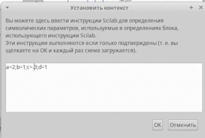
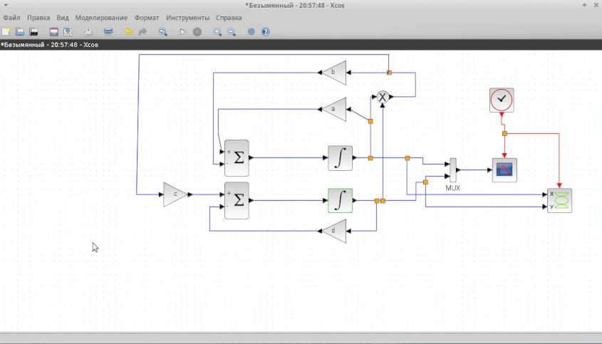
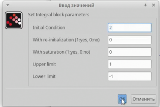
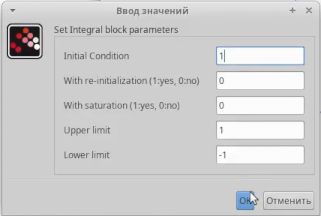
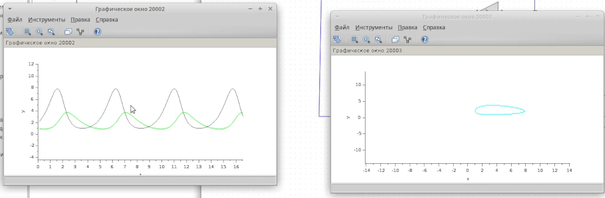
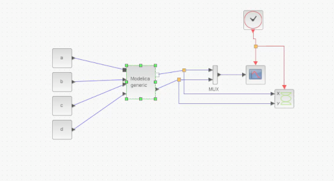
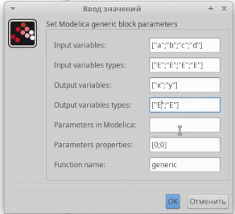
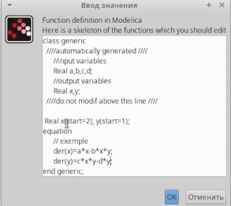

---
## Front matter
lang: ru-RU
title: "Презентация по лабораторной работе 6"
author: "Андрей Гэинэ"

## Formatting
toc: false
slide_level: 2
theme: metropolis
header-includes: 
 - \metroset{progressbar=frametitle,sectionpage=progressbar,numbering=fraction}
 - '\makeatletter'
 - '\beamer@ignorenonframefalse'
 - '\makeatother'
aspectratio: 43
section-titles: true
---
# Цель работы

Научиться строить модель "Хищник-жертва" с помощью xcos и c помощью xcos с блоком Modelica

# Задание

Реализуйте модель «хищник – жертва» в OpenModelica. Постройте
графики изменения численности популяций и фазовый портрет.

# Теоретическое введение

Модель «хищник–жертва» (модель Лотки — Вольтерры) представляет собой модель
межвидовой конкуренции. В математической
форме модель имеет вид:
$$
\begin{cases}
    \dot x = ax - bxy \\ % & is your "\tab"-like command (it's a tab alignment character)
    \dot y = cxy - dy
\end{cases}
$$
где x — количество жертв; y — количество хищников; a, b, c, d — коэффициенты, отражающие взаимодействия между видами: a — коэффициент рождаемости
жертв; b — коэффициент убыли жертв; c — коэффициент рождения хищников; d —
коэффициент убыли хищников.

# Выполнение лабораторной работы

Зафиксируем начальные данные: a = 2, b = 1, c = 0, 3, d = 1, x(0) = 2, y(0) = 1

#

В параметрах блоков интегрирования необходимо задать начальные значения x(0) = 2, y(0) = 1

#

Динамика изменения численности хищников и жертв модели и фазовый портрет модели

#

Реализация модели с помощью блока Modelica в xcos

#

Параметры блока Modelica

#

Код на языке Modelica

# Выводы

В ходе выполнения лабораторной работы научились создать модель "Хищник-жертва".