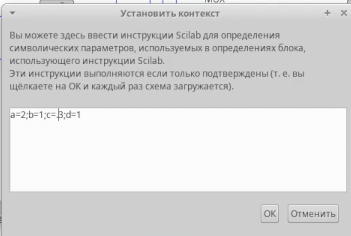
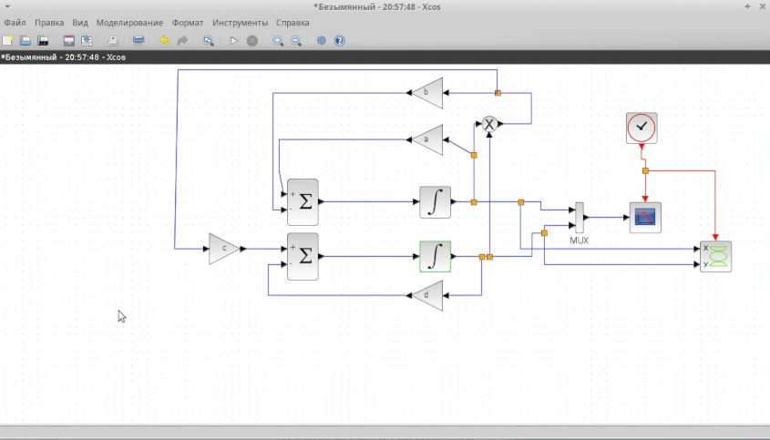
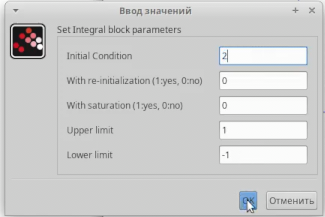
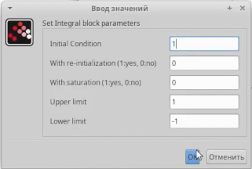
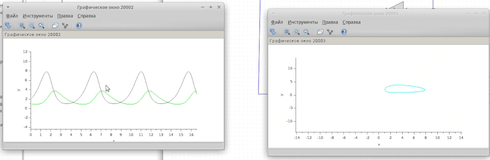
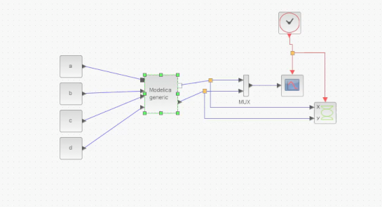
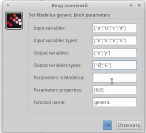
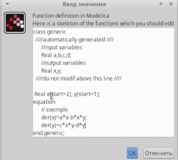

---
## Front matter
title: "Лабораторная работа 6"
author: "Андрей Гэинэ"

## Generic otions
lang: ru-RU
toc-title: "Содержание"

## Bibliography
bibliography: bib/cite.bib
csl: pandoc/csl/gost-r-7-0-5-2008-numeric.csl

## Pdf output format
toc: true # Table of contents
toc-depth: 2
lof: true # List of figures
lot: true # List of tables
fontsize: 12pt
linestretch: 1.5
papersize: a4
documentclass: scrreprt
## I18n polyglossia
polyglossia-lang:
  name: russian
  options:
	- spelling=modern
	- babelshorthands=true
polyglossia-otherlangs:
  name: english
## I18n babel
babel-lang: russian
babel-otherlangs: english
## Fonts
mainfont: Noto Serif
romanfont: Noto Serif
sansfont: Noto Serif
monofont: Noto Serif
mathfont: Noto Serif
mainfontoptions: Ligatures=Common,Ligatures=TeX,Scale=0.94
romanfontoptions: Ligatures=Common,Ligatures=TeX,Scale=0.94
sansfontoptions: Ligatures=Common,Ligatures=TeX,Scale=MatchLowercase,Scale=0.94
monofontoptions: Scale=MatchLowercase,Scale=0.94,FakeStretch=0.9
mathfontoptions:
## Biblatex
biblatex: true
biblio-style: "gost-numeric"
biblatexoptions:
  - parentracker=true
  - backend=biber
  - hyperref=auto
  - language=auto
  - autolang=other*
  - citestyle=gost-numeric
## Misc options
indent: true
header-includes:
  - \usepackage{indentfirst}
  - \usepackage{float} # keep figures where there are in the text
  - \floatplacement{figure}{H} # keep figures where there are in the text
---

# Цель работы

Научиться строить модель "Хищник-жертва" с помощью xcos и c помощью xcos с блоком Modelica

# Задание

Реализуйте модель «хищник – жертва» в OpenModelica. Постройте
графики изменения численности популяций и фазовый портрет.

# Теоретическое введение

Модель «хищник–жертва» (модель Лотки — Вольтерры) представляет собой модель
межвидовой конкуренции. В математической
форме модель имеет вид:
$$
\begin{cases}
    \dot x = ax - bxy \\ % & is your "\tab"-like command (it's a tab alignment character)
    \dot y = cxy - dy
\end{cases}
$$
где x — количество жертв; y — количество хищников; a, b, c, d — коэффициенты, отражающие взаимодействия между видами: a — коэффициент рождаемости
жертв; b — коэффициент убыли жертв; c — коэффициент рождения хищников; d —
коэффициент убыли хищников.

# Выполнение лабораторной работы

Зафиксируем начальные данные: a = 2, b = 1, c = 0, 3, d = 1, x(0) = 2, y(0) = 1

Реализуем модель в xcos

В параметрах блоков интегрирования необходимо задать начальные значения x(0) = 2, y(0) = 1

Динамика изменения численности хищников и жертв модели и фазовый портрет модели

Реализация модели с помощью блока Modelica в xcos

Параметры блока Modelica

Код на языке Modelica

# Выводы

В ходе выполнения лабораторной работы научились создать модель "Хищник-жертва".
