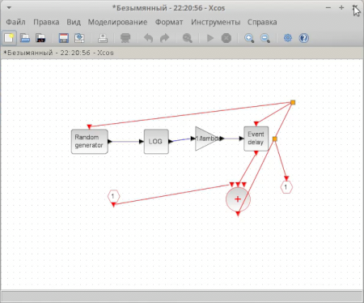
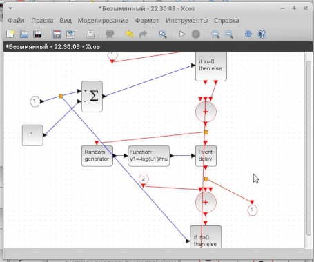
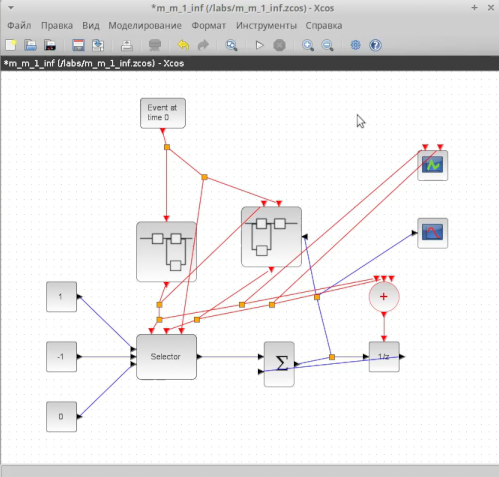
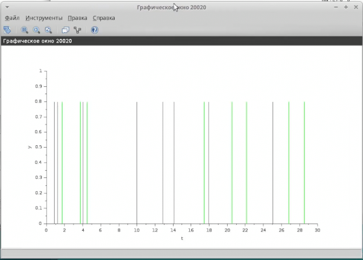
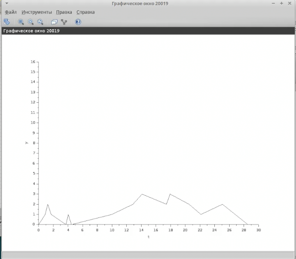

---
## Front matter
lang: ru-RU
title: "Презентация по лабораторной работе 7"
author: "Андрей Гэинэ"

## Formatting
toc: false
slide_level: 2
theme: metropolis
header-includes: 
 - \metroset{progressbar=frametitle,sectionpage=progressbar,numbering=fraction}
 - '\makeatletter'
 - '\beamer@ignorenonframefalse'
 - '\makeatother'
aspectratio: 43
section-titles: true
---
# Цель работы

Научиться строить модель "Модель M|M|1|inf" с помощью xcos

# Задание

Реализуйте модель «Модель M|M|1|inf» в xcos

# Теоретическое введение

Модель M|M|1|inf — это одна из базовых моделей теории массового обслуживания, которая описывает систему с одним обслуживающим прибором (сервером), где заявки поступают согласно пуассоновскому процессу, а время обслуживания имеет экспоненциальное распределение. 

# Выполнение лабораторной работы

Зафиксируем начальные данные: λ = 0.3, µ = 0.35, z0 = 6

#

Суперблок, моделирующий поступление заявок

#

Суперблок, моделирующий процесс обработки заявок

#

Готовая модель M|M|1|inf

#

Результат моделирования 1

#

Результат моделирования 2

# Выводы

В ходе выполнения лабораторной работы научились создать модель "Модель M|M|1|inf".